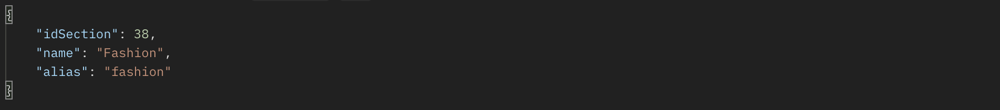
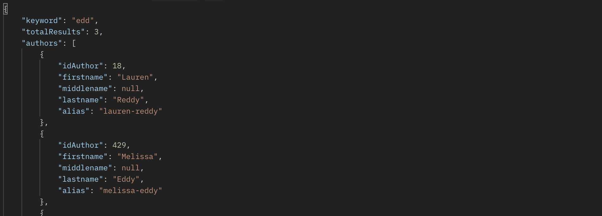
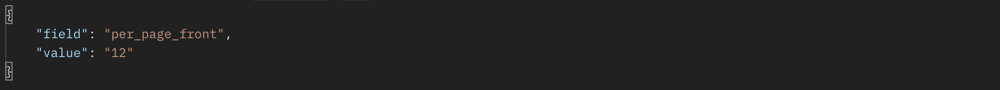

# BT \| Technical Challenge PHP

	Autor: Liviu Hariton <liviu.hariton@gmail.com>
	Date: 15.05.2023

[Cerința inițială este disponibilă aici](https://github.com/liviu-hariton/BT_Demo/blob/main/docs/cerinta.md).

### Cuprins:

-   API
-   Admin -- gestionare conținut
-   Front -- consumare conținut via API 
-   Alte detalii

\-\-\-\-\-\-\-\-\-\-\-\-\-\-\-\-\-\-\-\-\-\-\-\-\-\-\-\-\-\-\-\-\-\-\-\-\-\-\-\-\-\-\-\-\-\-\-\-\-\-\-\-\-\-\-\-\-\-\-\-\-\-\-\-\-\-\-\-\-\-\-\-\-\-\-\-\-\-\-\-\-\-\-\-\-\-\-\-\-\-\-\-\-\-\-\-\-\-\-\-\-\-\-\-\-\-\-\-\-\-\-\-\-\-\-\-\-\-\-\-\-\-\-\-\-\-\-\-\-\-\-\-\-\-\-\-\-\-\-\-\-\-\-\-\-\-\-\-\--

## API

Rest API endpoint: **/api/**

-   Live demo endpoint: <https://btdemo.liviuhariton.com/api/>
-   Sursă: <https://github.com/liviu-hariton/BT_Demo/blob/main/api.php>

Metode disponibile:

-   **Articole** -
    <https://github.com/liviu-hariton/BT_Demo/blob/main/library/app/api/Articles.php>

    -   */articles/getall*
    -   */articles/getlatest*
    -   */articles/getlatestinsection/*
    -   */articles/getlatestbyauthor/*
    -   */articles/getbydate/*
    -   */articles/getbyid/*
    -   */articles/search/*
    -   */articles/getbysection/*
    -   */articles/getbyauthor/*

-   **Secțiuni** -
    <https://github.com/liviu-hariton/BT_Demo/blob/main/library/app/api/Sections.php>

    -   */sections/getall*
    -   */sections/getbyid/*
    -   */sections/getbyslug/*
    -   */sections/search/*

-   **Autori** -
    <https://github.com/liviu-hariton/BT_Demo/blob/main/library/app/api/Authors.php>

    -   */authors/getall*
    -   */authors/getbyid/*
    -   */authors/getbyslug/*
    -   */authors/search/*

-   **Setări** -
    <https://github.com/liviu-hariton/BT_Demo/blob/main/library/app/api/Settings.php>
    -   */settings/get/*

**/articles/getall**

Listează toate articolele disponibile în baza de date a aplicației

-   Apelare: /api/articles/getall

    -   Acceptă parametru opțional numeric reprezentând pagina curentă
    -   Exemplu: /api/articles/getall/**3** va returna toate articolele
        aferente paginii 3
    -   Numărul de elemente pe pagină se stabilește în secțiunea *Admin
        -- gestionare conținut*

Live demo:

-   <https://btdemo.liviuhariton.com/api/articles/getall/>
-   <https://btdemo.liviuhariton.com/api/articles/getall/3>

Exemplu răspuns:

**/articles/getlatest**

Livrează cel mai recent articol inserat în baza de date

-   Apelare: /api/articles/getlatest

Live demo:

-   <https://btdemo.liviuhariton.com/api/articles/getlatest>

Exemplu răspuns:

**/articles/getlatestinsection/**

Livrează cel mai recent articol inserat în baza de date, în secțiunea
specificată

-   Apelare: /api/articles/getlatestinsection

    -   Acceptă parametru obligatoriu numeric reprezentând ID-ul
        secțiunii dorite
    -   Exemplu: /api/articles/getlatestinsection/**3** va returna cel
        mai recent articol disponibil în secțiunea "*Arts*"
    -   ID-urile secțiunilor disponibile se obțin prin /sections/getall
        (vezi documentația aferentă)

Live demo:

-   <https://btdemo.liviuhariton.com/api/articles/getlatestinsection/3>

Exemplu răspuns:

**/articles/getlatestbyauthor/**

Livrează cel mai recent articol inserat în baza de date, publicat /
semnat de către autorul specificat

-   Apelare: /api/articles/getlatestbyauthor

    -   Acceptă parametru obligatoriu numeric reprezentând ID-ul
        autorului dorit
    -   Exemplu: /api/articles/getlatestbyauthor/**733** va returna cel
        mai recent articol publicat / semnat de autorul "*Scott
        Cacciola*"
    -   ID-urile autorilor disponibili se obțin prin /authors/getall
        (vezi documentația aferentă)

Live demo:

-   <https://btdemo.liviuhariton.com/api/articles/getlatestinsection/3>

Exemplu răspuns:

**/articles/getbydate/**

Livrează toate articolele publicate la data specificată

-   Apelare: /api/articles/getbydate

    -   Acceptă parametru obligatoriu reprezentând data dorită în format
        dd.mm.yyyy
    -   Exemplu: /api/articles/getbydate/**13.05.2023**

Live demo:

-   <https://btdemo.liviuhariton.com/api/articles/getbydate/13.05.2023>

Exemplu răspuns:

**/articles/getbyid/**

Livrează toate detaliile articolului specificat

-   Apelare: /api/articles/getbyid

    -   Acceptă parametru obligatoriu numeric reprezentând ID-ul
        articolului dorit
    -   Exemplu: /api/articles/getbyid/**1103**
    -   ID-urile articolelor disponibile se obțin prin /articles/getall
        (vezi documentația aferentă)

Live demo:

-   <https://btdemo.liviuhariton.com/api/articles/getbyid/1103>

Exemplu răspuns:

**/articles/search/**

Livrează toate articolele publicate și care corespund criteriului
specificat

-   Apelare: /api/articles/search

    -   Acceptă parametru obligatoriu reprezentând criteriul de căutare
    -   Exemplu: /api/articles/search/**silicon**

Live demo:

-   <https://btdemo.liviuhariton.com/api/articles/search/silicon>

Exemplu răspuns:

**/articles/getbysection/**

Livrează toate articolele disponibile în baza de date și asociate
secțiunii specificate

-   Apelare: /api/articles/getbysection

    -   Acceptă parametru obligatoriu numeric reprezentând ID-ul
        secțiunii dorite
    -   Exemplu: /api/articles/getbysection/**3** va returna toate
        articolele disponibile în secțiunea "*Arts*"
    -   ID-urile secțiunilor disponibile se obțin prin /sections/getall
        (vezi documentația aferentă)

Live demo:

-   <https://btdemo.liviuhariton.com/api/articles/getbysection/3>

Exemplu răspuns:

**/articles/getbyauthor/**

Livrează toate articolele disponibile în baza de date, publicate /
semnate de către autorul specificat

-   Apelare: /api/articles/getbyauthor

    -   Acceptă parametru obligatoriu numeric reprezentând ID-ul
        autorului dorit
    -   Exemplu: /api/articles/getbyauthor/**733** va returna toate
        articolele publicate / semnate de autorul "*Scott Cacciola*"
    -   ID-urile autorilor disponibili se obțin prin /authors/getall
        (vezi documentația aferentă)

Live demo:

-   <https://btdemo.liviuhariton.com/api/articles/getlatestinsection/3>

Exemplu răspuns:

**/sections/getall**

Listează toate secțiunile disponibile în baza de date a aplicației

-   Apelare: /api/sections/getall

Live demo:

-   <https://btdemo.liviuhariton.com/api/sections/getall>

Exemplu răspuns:

**/sections/getbyid/**

Livrează toate detaliile secțiunii specificate

-   Apelare: /api/sections/getbyid

    -   Acceptă parametru obligatoriu numeric reprezentând ID-ul
        secțiunii dorite
    -   Exemplu: /api/sections/getbyid/**38**
    -   ID-urile autorilor disponibili se obțin prin /sections/getall
        (vezi documentația aferentă)

Live demo:

-   <https://btdemo.liviuhariton.com/api/sections/getbyid/38>

Exemplu răspuns:

**/sections/getbyslug/**

Livrează toate detaliile secțiunii specificate

-   Apelare: /api/sections/getbyslug

    -   Acceptă parametru obligatoriu reprezentând slug-ul (url
        alias-ul) secțiunii

Live demo:

-   <https://btdemo.liviuhariton.com/api/sections/getbyslug/fashion>

Exemplu răspuns:

**/sections/search/**

Livrează toate articolele publicate și care corespund criteriului
specificat

-   Apelare: /api/sections/search/

    -   Acceptă parametru obligatoriu reprezentând criteriul de căutare
    -   Exemplu: /api/sections/search/**usine**

Live demo:

-   <https://btdemo.liviuhariton.com/api/sections/search/usine>

Exemplu răspuns:

**/authors/getall**

Listează autorii disponibili în baza de date a aplicației

-   Apelare: /api/authors/getall

Live demo:

-   <https://btdemo.liviuhariton.com/api/authors/getall>

Exemplu răspuns:

**/authors/getbyid/**

Livrează toate detaliile autorului specificat

-   Apelare: /api/authors/getbyid

    -   Acceptă parametru obligatoriu numeric reprezentând ID-ul
        autorului dorit
    -   Exemplu: /api/authors/getbyid/**38**
    -   ID-urile autorilor disponibili se obțin prin /authors/getall
        (vezi documentația aferentă)

Live demo:

-   <https://btdemo.liviuhariton.com/api/authors/getbyid/38>

Exemplu răspuns:

**/authors/getbyslug/**

Livrează toate detaliile autorului specificat

-   Apelare: /api/authors/getbyslug

    -   Acceptă parametru obligatoriu reprezentând slug-ul (url
        alias-ul) autorului

Live demo:

-   <https://btdemo.liviuhariton.com/api/authors/getbyslug/raphael-minder>

Exemplu răspuns:

**/authors/search/**

Livrează toți autorii care corespund criteriului specificat

-   Apelare: /api/authors/search/

    -   Acceptă parametru obligatoriu reprezentând criteriul de căutare
    -   Exemplu: /api/authors/search/**edd**

Live demo:

-   <https://btdemo.liviuhariton.com/api/authors/search/edd>

Exemplu răspuns:

**/settings/get/**

Livrează valoarea setării specificate a aplicației

-   Apelare: /api/settings/get

    -   Acceptă parametru obligatoriu reprezentând denumirea setării
    -   Exemplu: /api/ settings/get/**per_page_front**

Parametri posibili:

-   *front_template* -- template-ul folosit în Front
-   *admin_template* -- template-ul folosit în Admin
-   *content_source* -- sursa din care se sincronizează conținutul (vezi
    secțiunea *Admin -- gestionare conținut*)
-   *nyt_endpoint* -- Endpoint-ul API-ului New York Times (vezi
    secțiunea *Admin -- gestionare conținut*)
-   *nyt_apikey* -- API Key-ul New York Times (vezi secțiunea *Admin --
    gestionare conținut*)
-   *content_file_select* -- fișierul folosit pentru importul
    conținutului dacă sursa activă este cea locală (vezi secțiunea
    *Admin -- gestionare conținut*)
-   *per_page* -- elemente pe pagină în Admin
-   *per_page_front* -- elemente pe pagină în Front

Live demo:

-   <https://btdemo.liviuhariton.com/api/settings/get/per_page_front>

Exemplu răspuns:

## Admin -- gestionare conținut

Live demo: <https://btdemo.liviuhariton.com/admin/>

Permite gestionarea conținutului sincronizat precum și organizarea lui
în secțiuni care să permită o manipulare mai ușoară a acestuia.

Secțiuni disponibile:

-   ***Dashboard*** -- un sumar general
-   ***Articole*** - <https://btdemo.liviuhariton.com/admin/articles/>
    -   O listă cu toate articolele disponibile în baza de date

-   ***Secțiuni*** - <https://btdemo.liviuhariton.com/admin/sections/>
    -   O listă cu toate secțiunile disponibile în baza de date

-   ***Autori*** - <https://btdemo.liviuhariton.com/admin/authors/>
    -   O listă cu toți autorii disponibili în baza de date

-   ***Configurări*** -
    <https://btdemo.liviuhariton.com/admin/settings/>
    -   Zonă în care sunt gestionați diverși parametrii de configurare
        ai aplicației

### Dashboard

Sunt prezentate, pe scurt, totalurile de articole, secțiuni și autori
disponibile în baza de date precum și link-uri penru fiecare pentru a
putea accesa detaliile

### Articole

Este prezentată lista cu toate articolele disponibile în baza de date.

Pentru fiecare articol în parte sunt disponibile următoarele informații:

-   ID intern
-   Imaginea articolului
-   Titlul
-   Paragraful introductiv
-   ID-ul New York Times
-   URL-ul articolului din site-ul nytimes.com
-   Sursa articolului
-   Autorul articolului
    -   La click se afișează toate articolele autorului respectiv
-   Secțiunea din care face parte articolul
    -   La click se afișează toate articolele din secținea respectivă
    -   Acolo unde este cazul, se afișează și subsecțiunea articolului

-   Momentul publicării articolului pe nytimes.com
    -   La mouse-over peste  este afișată data completă

-   Momentul inserării articolului în baza de date a aplicației
    -   La mouse-over peste  este afișată data completă

### Secțiuni

Sunt prezentate toate secțiunile disponibile în baza de date

Pentru fiecare secțiune în parte sunt disponibile următoarele
informații:

-   ID-ul secțiunii
-   Denumirea
-   Numărul de subsecțiuni
-   Numărul de articole asociate

La click pe  sunt afișate toate articolele din
secțiunea respectivă.

### Autori

Sunt prezentați toți autorii disponibili în baza de date

Pentru fiecare autor în parte sunt disponibile următoarele informații:

-   ID-ul autorului
-   Prenume
-   Al doilea prenume
-   Nume
-   Numărul de articole publicate / semnate

La click pe  sunt afișate toate articolele autorului
respectiv.

### Configurare

Tab-ul "*Generale*" -- se pot configura:

-   Template-ul folosit în Front
-   Template-ul folosit în Admin
-   Numărul de elemente afișate pe o pagină în listing-urile din Admin
-   Numărul de elemente afișate pe o pagină în listing-urile din front

Tab-ul "*Continut*"

-   Putem alege sursa din care este sincronizat conținutul:
    -   Fișier local (precum cel furnizat în challenge)
        -   Se poate alege din fișierele încărcate anterior sau se poate
            încărca un fișier nou
    -   Remote, prin intermediul API-ului pus la dispoziție de New York
        Times - <https://developer.nytimes.com/>
        -   Sunt furnizate:
            -   Endpoint
            -   API Key

-   Se poate opta pentru importul datelor în momentul salvării
    parametrilor de mai sus însă, în funcție de volumul de articole ce
    urmează a fi procesate, procesul poate dura

    -   Am setat un CronJob pe server care sincronizează conținutul o dată pe zi, la ora 08:00
        -   0 8 \* \* \* /usr/local/bin/php
            /btdemo.liviuhariton.com/cron/fetch.php

## Front -- consumare conținut via API

Live demo: <https://btdemo.liviuhariton.com/>

Front-ul consumă conținutul folosind strict API-ul descris mai sus -
<https://btdemo.liviuhariton.com/api/>

-   În acest scop este disponibil un wrapper / SDK pentru a putea accesa
    API-ul și metodele acestuia
    -   Sursa:
        <https://github.com/liviu-hariton/BT_Demo/blob/main/library/vendor/btdemo-sdk/BT_Demo_API.php>

-   Sunt listate secțiunile disponibile în baza de date folosind
    /api/sections/getall

-   Reprezintă cel mai recent articol din baza de date fiind obținut cu
    metda /api/articles/getlatest

-   Reprezintă articole disponibile în baza de date, obținute cu metoda
    /api/articles/getall

Fiecare nume de autor și fiecare nume de categorie sunt clickabile
fiecare dintre ele ducând utilizatorului în listing-ul aferent -- toate
articolele autorului respectiv toate articolele din secțiunea

Exemplu de secțiune: <https://btdemo.liviuhariton.com/climate/c>

Sunt listate aceleași tipuri de date ca pe homepage și folosind
următoarele metode:

-   /api/articles/getlatestinsection/
-   /api/articles/getbysection/

Exemplu de autor:
<https://btdemo.liviuhariton.com/clare-toeniskoetter/a>

Sunt listate aceleași tipuri de date ca pe homepage și folosind
următoarele metode:

-   /api/articles/getlatestbyauthor/
-   /api/articles/getbyauthor/

## Alte detalii

La dezvoltarea aplicației "*BT Demo*" (BT \| Technical Challenge PHP) nu
a fost folosit niciun framework PHP existent.

Dev time: \~22 ore

Live demo-ul rulează pe un stack LAMP cu următoarele caracteristici:

-   PHP 8.0.28
-   Apache 2.4.57
-   MySQL 8.0.32-cll-lve
-   OS: Linux

S-au folosit următoarele librării terțe:

-   *Guzzle*

    -   <https://docs.guzzlephp.org/en/stable/>
    -   Scop: procesarea conținutului remote - preluare și salvare în
        local a imaginii articolului -- atunci când sursa conținutului
        este fișier local -- news.json (caz în care nu este disponibilă
        o referință directă către imaginiea articolului)

-   *Illuminate Database*

    -   <https://github.com/illuminate/database>
    -   Scop: conectarea la baza de date în care este stocat conținutul
        aplicației

-   *JSON Machine*

    -   <https://github.com/halaxa/json-machine>
    -   Scop: procesarea surselor / fișierelor JSON

-   *php Pagination*

    -   <https://github.com/yidas/php-pagination>
    -   Scop: generarea de paginații în secțiuni de listing-uri

-   *PHP TimeAgo*

    -   <https://github.com/jimmiw/php-time-ago>
    -   Scop: afișarea timpului trecut de la momentul X în forma "*acum
        un minut*", "*acum 2 zile*" etc.

Template front: <https://getbootstrap.com/docs/5.3/examples/blog/>

Template admin: <https://getbootstrap.com/docs/5.3/examples/dashboard/>

Pe lângă funcționalitățile implementate, există potențial și pentru
următoarele (și nu numai):

-   \[General\]
    -   trimitere notificare (via mail) la fiecare update de conținut cu
        sumarul (articole noi, secțiuni noi, autori noi)

-   \[Admin\]
    -   setarea preferențială, per secțiune, a elementelor pe pagină
    -   autentificare în admin
    -   sortare listing autori alfabetic / număr de articole
    -   editare / ștergere detalii autor
    -   editare / ștergere articol
    -   editare / ștergere secțiune / subsecțiune
    -   cautare articole, autori și / sau secțiuni
-   \[API\]

    -   implementare metode PUT / POST / DELETE
    -   listare subsecțiuni în secțiunea curentă
    -   listare articole în subsecțiunea
    -   implementare paginație în listarea articolelor din secțiune /
        autor

-   \[Front\]

    -   introducere paginație în listing autor / secțiune
    -   căutare articole & rezultate căutare
    -   afișare subsecțiune în detaliile articolului
    -   implementare SEO
    -   implementare pagină detaliu articol
    -   împrospătare automată a paginii (via XHR / Ajax)
